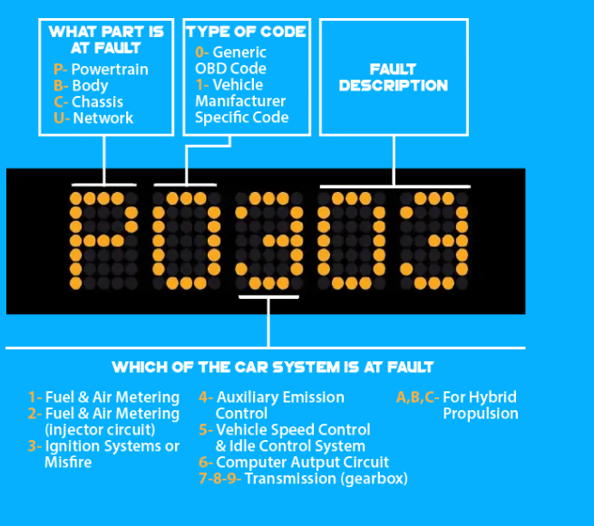
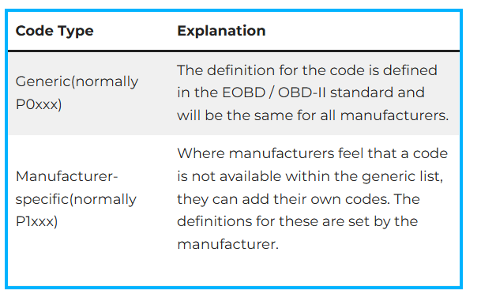
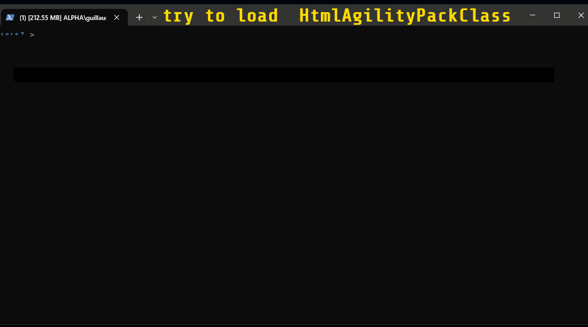
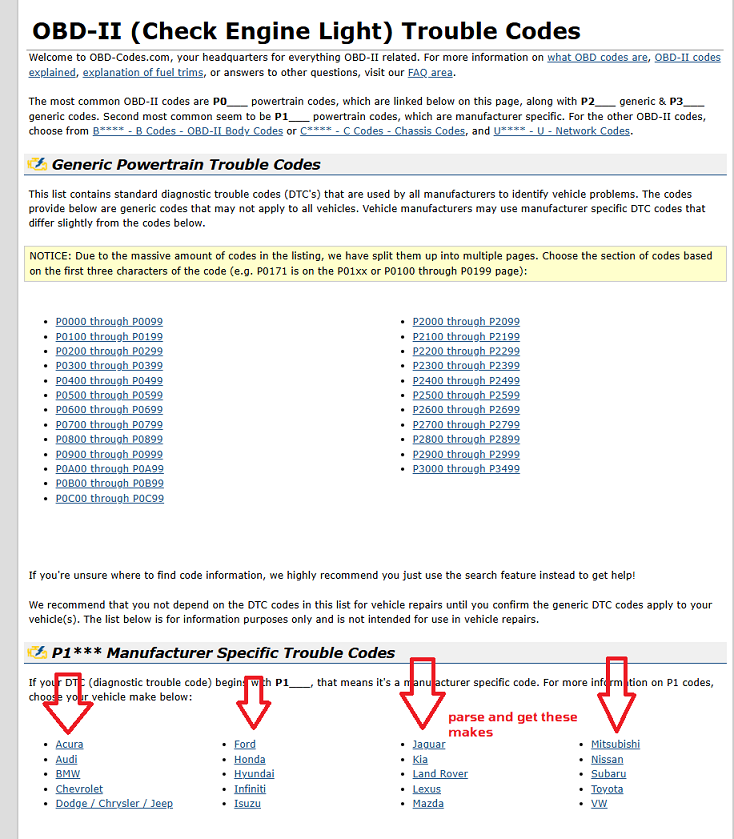
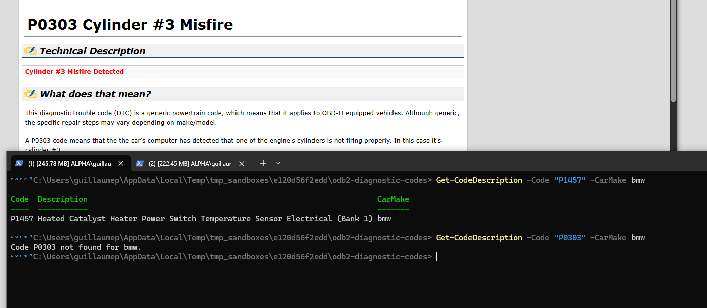
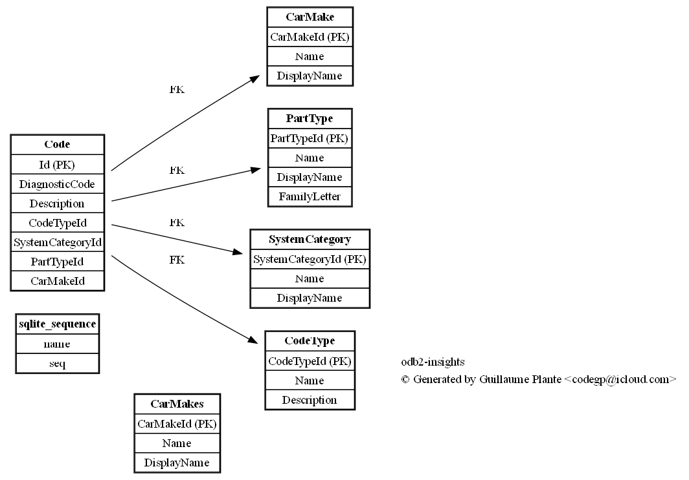
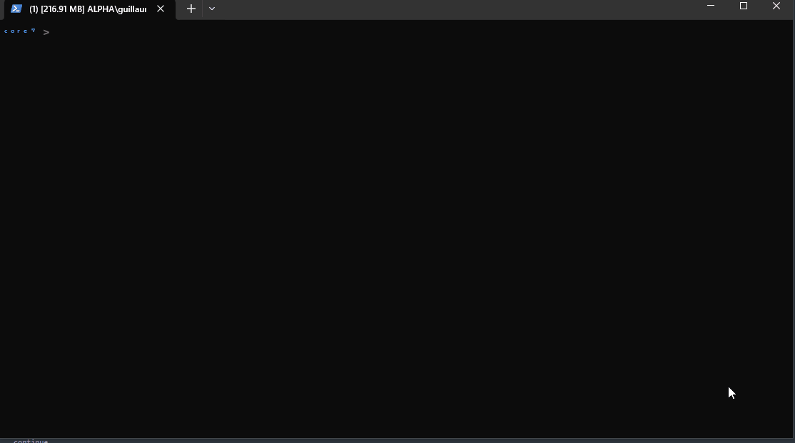

<center>
    
</center>

## What's This ?

It's my lazy attempt at setting up a database containing all the possible ODB2 diagnostic codes.

## Project Structure

```bash
Project Structure: .
html
├── css
├── db
├── data
│   ├── generic
│   ├── specific
├── fonts
├── img
├── js
├── logs
├── metadata
├── scss
├── svgs
│   ├── brands
│   ├── regular
│   ├── solid
├── webfonts
```

## Data Files

```bash
├── data
│   ├── generic
│   ├── specific
```

```bash
$ ls data/generic/*.json

data/generic/b.json  data/generic/c.json  data/generic/p.json  data/generic/u.json

$ ls data/specific/*.json

data/specific/acura.json     data/specific/dodge.json    data/specific/infiniti.json  data/specific/land.json        data/specific/rover.json
data/specific/audi.json      data/specific/ford.json     data/specific/isuzu.json     data/specific/lexus.json       data/specific/toyota.json
data/specific/bmw.json       data/specific/honda.json    data/specific/jeep.json      data/specific/mitsubishi.json  data/specific/vw.json
data/specific/chrysler.json  data/specific/hyundai.json  data/specific/kia.json       data/specific/nissan.json
```

## What is a Diagnostic Trouble Code (DTC)?

Diagnostic trouble codes, in broad terms, are codes that computer diagnostic system in a given car has. The system displays a certain code depending on what kind of problem that the system can detect from inside of a car.
Diagnostic trouble costs are used to help car mechanics and owners with a rich expertise in car maintenance understand problems with the car and where the root of the car’s problem or problems may lie.
These codes must be used along with the car’s manual to determine what needs to be examined and tested to properly diagnose a car’s problem whether from professional OBD 2 software or with a car code reader.


## Explication of Diagnostic Codes

DTCs come in a string of five characters. One code for example, might be “P0806”.

<center></center>

The first character will either be P (powertrain), B (Body-AC/Airbag), C (chassis-ABS) or U (network-CAN/BUS). This character will help you determine which of the four main car’s parts is at fault.

The second character either will be a 0 or 1. 0 means it is a generic OBD 2 code. 1 means it is a car manufacturer exclusive code.

The third character can be one of many letters or numbers. This list of characters include 1 (fuel and air metering), 2 (fuel and air metering-injector circuit), 3 (ignition system or misfire), 4 (auxiliary emission control), 5 (vehicle speed and idle control systems), 6 (computer autput circuit), 7,8 or 9 (transmission) and A, B or C (hybrid propulsion).

The fourth and fifth characters in the code represent a specific description of the problem with the part and system in question. These are numbered by “00”, “01”, “02” and so on.

In total, there are over 5000 generic and manufacturer exclusive OBD 2 troubleshooting codes that exist. You can refer to our master list of DTCs to help you best understand your specific car problem based on your code.


## Difference Between Generic & Manufacturer Specific…

As explained earlier, general DTCs start with P0XXX, and manufacturer exclusive DTCs start with P1XXX. Generic DTCs are defined in the standards for OBD 2 and EOBD 2, and applies to all official car manufacturers.

Manufacturer exclusive DTCs, however, are not available in the generic code databases, and are instead created and defined by a car manufacturer for all the cars they make.

<center></center>

| **Powertrain Codes** |        **TYPE**        |
|:--------------------:|:----------------------:|
|         P0xxx        |         Generic        |
|         P1xxx        | Manufacturer -specific |
|         P0xxx        |         Generic        |
|      P30xx-P33xx     | Manufacturer -specific |
|      P34xx-P39xx     |         Generic        |

| **Chassis Codes** |        **TYPE**        |
|:-----------------:|:----------------------:|
|       C0xxx       |         Generic        |
|       C1xxx       | Manufacturer -specific |
|       C2xxx       | Manufacturer -specific |
|       C3xxx       |         Generic        |


| **Body Codes** |        **TYPE**        |
|:--------------:|:----------------------:|
|     B0xxx      |         Generic        |
|     B1xxx      | Manufacturer -specific |
|     B2xxx      | Manufacturer -specific |
|     B30xx      |         Generic        |


| **Network Communication codes** |        **TYPE**        |
|:-------------------------------:|:----------------------:|
|              U0xxx              |         Generic        |
|              U1xxx              | Manufacturer -specific |
|              U1xxx              | Manufacturer -specific |
|              U0xxx              |         Generic        |


### B Codes

B codes are also broken down into generic and manufacturer-specific code lists and should be looked at carefully when diagnosing your vehicle. Again, B0000-B1000 and B3000-B4000 codes are generic, while codes between B1000-B3000 are manufacturer-specific and may not necessarily be found in generic databases.

### U Codes - Network

For networking codes, U0000 to U1000 and U3000 to U4000 are generic, whereas codes from U1000 to U3000 are manufacturer-specific.

### C Codes

Following the pattern of both B and U codes, chassis codes are generic when they range from C000-C1000 and C3000-C4000. DTCs that are between C1000-C3000 are manufacturer-specific and further research is needed to properly diagnose your car’s issue.

### P Codes

For powertrain codes, P0000 to P1000, P2000 to P3000 and P34xx and P39xx are generic, whereas codes from P1xxx to P2xxx and P30xx-P33xx are manufacturer-specific.


| **Powertrain Codes** |        **TYPE**        |
|:--------------------:|:----------------------:|
|         P0xxx        |         Generic        |
|         P1xxx        | Manufacturer -specific |
|         P2xxx        |         Generic        |
|      P30xx-P33xx     | Manufacturer -specific |
|      P34xx-P39xx     |         Generic        |

| **Chassis Codes** |        **TYPE**        |
|:-----------------:|:----------------------:|
|       C0xxx       |         Generic        |
|       C1xxx       | Manufacturer -specific |
|       C2xxx       | Manufacturer -specific |
|       C3xxx       |         Generic        |


| **Body Codes** |        **TYPE**        |
|:--------------:|:----------------------:|
|     B0xxx      |         Generic        |
|     B1xxx      | Manufacturer -specific |
|     B2xxx      | Manufacturer -specific |
|     B30xx      |         Generic        |


| **Network Communication codes** |        **TYPE**        |
|:-------------------------------:|:----------------------:|
|              U0xxx              |         Generic        |
|              U1xxx              | Manufacturer -specific |
|              U1xxx              | Manufacturer -specific |
|              U0xxx              |         Generic        |


## Resources

 I have found the following online resources for codes

1. [obd2pros](https://obd2pros.com/dtc-codes)
2. [obd-codes.com](https://www.obd-codes.com/trouble_codes/)
3. [Kelly's Blue Book](https://www.kbb.com/obd-ii/)


## Resolving Codes

So I will write PowerShell Scripts to parse web pages, and fetwch the code and it's description base of what you enter.
Maybe I'll generate a SQLite Database as well....

To be COndinued...


## P1*** Manufacturer Specific Trouble Codes

P1*** Manufacturer Specific Trouble Codes If your DTC (diagnostic trouble code) begins with **P1**\_\_\_, that means it's a manufacturer specific code. For more information on P1 codes, choose your vehicle make below: 

- [Acura](https://www.obd-codes.com/trouble_codes/acura/)
- [Audi](https://www.obd-codes.com/trouble_codes/audi/)
- [BMW](https://www.obd-codes.com/trouble_codes/bmw/)
- [Chevrolet](https://www.obd-codes.com/trouble_codes/chevrolet/)
- [Chrysler Dodge Jeep](https://www.obd-codes.com/trouble_codes/dodge/)
- [Ford](https://www.obd-codes.com/trouble_codes/ford/)
- [Honda](https://www.obd-codes.com/trouble_codes/honda/)
- [Hyundai](https://www.obd-codes.com/trouble_codes/hyundai/)
- [Infiniti](https://www.obd-codes.com/trouble_codes/infiniti/)
- [Isuzu](https://www.obd-codes.com/trouble_codes/isuzu/)
- [Jaguar](https://www.obd-codes.com/trouble_codes/jaguar/)
- [Kia](https://www.obd-codes.com/trouble_codes/kia/)
- [Land](https://www.obd-codes.com/trouble_codes/land/)
- [Rover](https://www.obd-codes.com/trouble_codes/rover/)
- [Lexus](https://www.obd-codes.com/trouble_codes/lexus/)
- [Mazda](https://www.obd-codes.com/trouble_codes/mazda/)
- [Mitsubishi](https://www.obd-codes.com/trouble_codes/mitsubishi/)
- [Nissan](https://www.obd-codes.com/trouble_codes/nissan/)
- [Subaru](https://www.obd-codes.com/trouble_codes/subaru/)
- [Toyota](https://www.obd-codes.com/trouble_codes/toyota/)
- [VW](https://www.obd-codes.com/trouble_codes/vw/)


Read more at: https://www.obd-codes.com/trouble_codes/
Copyright OBD-Codes.com


## Scripts

### HtmlAgilityPack

I use [Html Agility Pack (HAP)](https://html-agility-pack.net/), an HTML parser written in C# to read/write DOM and supports plain XPATH or XSLT to parse the pages where my data is stored.

You can download it using a [script](scripts/ps/Install-HtmlAgilityPack.ps1) I wrote:



### Parsing obd-codes.com

Suppose you want to get the list of manufacturers listed on this website:



```


function Get-AllCarMakes {
    [CmdletBinding(SupportsShouldProcess)]
    param()

    try {

        Add-Type -AssemblyName System.Web

        $Null = Register-HtmlAgilityPack

        $Ret = $False

        $Url = "https://www.obd-codes.com/trouble_codes/"
        $HeadersData = @{
           "authority"="www.obd-codes.com"
           "method"="GET"
           "path"="/trouble_codes/"
           "scheme"="https"
           "cache-control"="no-cache"
           "pragma"="no-cache"
           "priority"="u=0, i"
        }
        $Results = Invoke-WebRequest -UseBasicParsing -Uri $Url -Headers $HeadersData
        $Data = $Results.Content
        if ($Results.StatusCode -eq 200) {
            $Ret = $True
        }

        $HtmlContent = $Results.Content

        [HtmlAgilityPack.HtmlDocument]$HtmlDoc = @{}
        $HtmlDoc.LoadHtml($HtmlContent)
        $HtmlNode = $HtmlDoc.DocumentNode

        [System.Collections.ArrayList]$ParsedList = [System.Collections.ArrayList]::new()

        for ($x = 1; $x -lt 6; $x++) {
            for ($y = 1; $y -lt 6; $y++) {
                try {
                    $XPath = "/html/body/div/div[2]/div[3]/div[{0}]/ul/li[{1}]/a" -f $x,$y
                    $ResultNodeDesc = $HtmlNode.SelectSingleNode($XPath)

                    if (!$ResultNodeDesc) {
                        Write-Verbose "[$x,$y] EMPTY"
                        Continue;
                    }

                    [string]$CarMake = $ResultNodeDesc.InnerText
                    Write-Verbose "[$x,$y] FOUND $CarMake"
                    [void]$ParsedList.Add($CarMake)
                } catch {
                    Write-Verbose "$_"
                    continue;
                }
         }   
        }
        
        return $ParsedList
        
    }
    catch {
        Write-Warning "Error occurred: $_"
        return $null
    }
}
```

Then:

```powershell
 > GEt-AllCarMakes

Name       Description
----       -----------
acura      Acura
audi       Audi
bmw        BMW
chevrolet  Chevrolet
dodge      Dodge / Chrysler / Jeep
ford       Ford
honda      Honda
hyundai    Hyundai
infiniti   Infiniti
isuzu      Isuzu
jaguar     Jaguar
kia        Kia
landrover  Land Rover
lexus      Lexus
mazda      Mazda
mitsubishi Mitsubishi
nissan     Nissan
subaru     Subaru
toyota     Toyota
vw         VW
```


### Get-ManufacturerSpecificCodes

Will load a page in the manufacturer's specific list, for example, [bmw](https://www.obd-codes.com/trouble_codes/bmw/), download the page, parse it and export the codes to JSON format.

```powershell
> Get-ManufacturerSpecificCodes -CarMake audi

Code  Description
----  -----------
P1101 O2 Sensor Circ.,Bank1-Sensor1Voltage too Low/Air Leak
P1102 O2 Sensor Heating Circ.,Bank1-Sensor1 Short to B+
P1103 O2 Sensor Heating Circ.,Bank1-Sensor1 Output too Low
...

```


### Export-ManufacturerSpecificCodesJson

Will Export all the specific codes for all manufacturers, in a list of Json files. See the files [here](data/ManufacturerSpecificCodes). For Example [bmw.json](data/ManufacturerSpecificCodes/bmw.json)


```powershell
> Export-ManufacturerSpecificCodesJson
Wrote acura.json
Wrote audi.json
Wrote bmw.json
Wrote chevrolet.json
Wrote dodge.json
...

ls ManufacturerSpecificCodes

Mode                 LastWriteTime         Length Name
----                 -------------         ------ ----
-a---           5/29/2025 12:17 AM           4459 acura.json
-a---           5/29/2025 12:17 AM          58327 audi.json
-a---           5/29/2025 12:17 AM          26646 bmw.json
-a---           5/29/2025 12:17 AM              6 chrysler.json
-a---           5/29/2025 12:17 AM           8176 dodge.json
-a---           5/29/2025 12:17 AM          19469 ford.json
-a---           5/29/2025 12:17 AM           6681 honda.json
-a---           5/29/2025 12:17 AM          12856 hyundai.json
-a---           5/29/2025 12:17 AM           3243 infiniti.json
-a---           5/29/2025 12:17 AM           5176 isuzu.json
-a---           5/29/2025 12:17 AM              6 jeep.json
-a---           5/29/2025 12:17 AM           4378 kia.json
-a---           5/29/2025 12:17 AM              6 land.json
-a---           5/29/2025 12:17 AM           5248 lexus.json
-a---           5/29/2025 12:17 AM           1048 mitsubishi.json
-a---           5/29/2025 12:17 AM           2908 nissan.json
-a---           5/29/2025 12:17 AM              6 rover.json
-a---           5/29/2025 12:17 AM           3737 toyota.json
-a---           5/29/2025 12:17 AM              6 vw.json

```

### Get-CodeDescription


```
> Get-CodeDescription -Code "P1457" -CarMake bmw

Code  Description                                                                CarMake
----  -----------                                                                -------
P1457 Heated Catalyst Heater Power Switch Temperature Sensor Electrical (Bank 1) bmw
```

If it doesn't exists in the Manufacturere Specific COdes (Generic Code), it will open a web page:

<center></center>

## Update-CodeDescriptions

Will get codes for Chassis, PowerTrain, Body and Network.

```powershell
> . .\Update-CodeDescriptions.ps1

=========================================
Updating Body Codes
=========================================

Fetching Description for b00e6
Fetching Description for b00e7
Fetching Description for b00e8
Writing Body Codes Json File "W:\odb2-insights\html\data\bodycodes.json"

=========================================
Updating Powertrain Codes
=========================================

[Powertrain Codes] Found 24 Urls
[Powertrain Codes] 0) Listing Codes from "https://www.obd-codes.com/p00-codes"...
[Powertrain Codes] 1) Listing Codes from "https://www.obd-codes.com/p01-codes"...
[Powertrain Codes] 23) Listing Codes from "https://www.obd-codes.com/p34-codes"...


Writing Powertrain Codes Json File "W:\odb2-insights\html\data\powertraincodes.json"

=========================================
Updating Chassis Codes
=========================================


Writing Body Chassis Json File "W:\odb2-insights\html\data\chassiscodes.json"
```
## Get-GenericBodyCodes

Get all the Body Codes

```powershell
> Get-GenericBodyCodes

Code  Description                                                                                   Url                             Type
----  -----------                                                                                   ---                             ----
b0001 Driver Frontal Stage 1 Deployment Control (Subfault)                                          https://www.obd-codes.com/b0001 Body
b0002 Driver Frontal Stage 2 Deployment Control (Subfault)                                          https://www.obd-codes.com/b0002 Body
b0003 Driver Frontal Stage 3 Deployment Control (Subfault)                                          https://www.obd-codes.com/b0003 Body
```


## Get-GenericChassisCodes

Get all the Chassis Codes

```powershell
> Get-GenericChassisCodes

Code  Description                                                                                Url Type
----  -----------                                                                                --- ----
C0000 Vehicle Speed Information Circuit Malfunction                                              n/a Chassis
C0035 Left Front Wheel Speed Circuit Malfunction                                                 n/a Chassis
C0040 Right Front Wheel Speed Circuit Malfunction                                                n/a Chassis
C0800 Device Power #1 Circuit Malfunction                                                        n/a Chassis
C0896 Electronic Suspension Control (ESC) voltage is outside the normal range…                   n/a Chassis
```
## Get-GenericPowertrainCodes

Get all the Powertrain Codes

```powershell
> Get-GenericPowertrainCodes
[Powertrain Codes] Found 24 Urls
[Powertrain Codes] 0) Listing Codes from "https://www.obd-codes.com/p00-codes"...

Code  Description                                                                                                 Url                                                Type
----  -----------                                                                                                 ---                                                ----
P0001 Fuel Volume Regulator Control Circuit/Open                                                                  https://www.obd-codes.com/p0001                    Powertrain
P0002 Fuel Volume Regulator Control Circuit Range/Performance                                                     https://www.obd-codes.com/p0002                    Powertrain
P0003 Fuel Volume Regulator Control Circuit Low                                                                   https://www.obd-codes.com/p0003                    Powertrain
P0004 Fuel Volume Regulator Control Circuit High                                                                  https://www.obd-codes.com/p0004                    Powertrain
P0005 Fuel Shutoff Valve "A" Control Circuit/Open                                                                 https://www.obd-codes.com/p0005                    Powertrain


```

### Kelly's Error Codes Book

```powershell
$codeTable = Get-KellyBlueBookCodesTable
$description = $codeTable["P0420"]
Write-Host $description  # ➜ Catalyst System Efficiency Below Threshold (Bank 1)
```


## Database

### Schema




### To Test Data Extraction

Use the script ```scripts/Test.ps1```


### To Insert Data

Use the script ```scripts/Import-DataInDb.ps1```

